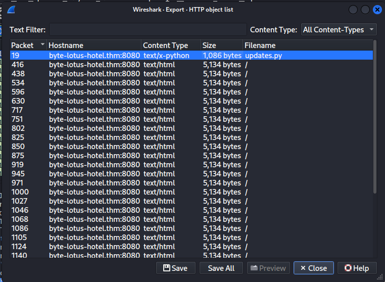
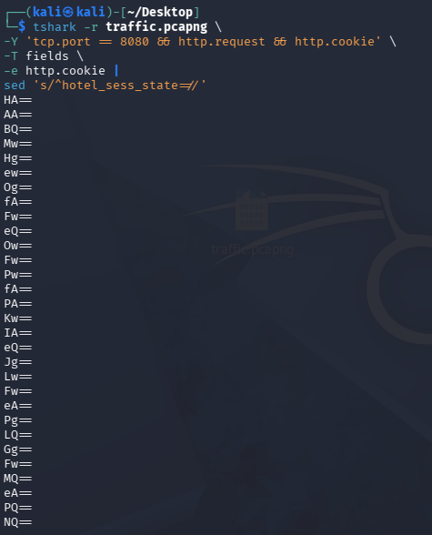
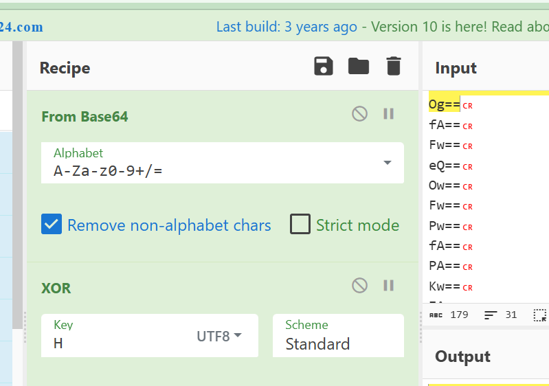

# 🏨 Hacker Holidays Day 4 - Packed Light

<p align="center">


</p>

---

# 📌 Challenge Overview

> **Tiny packets. Odd hours. Suspiciously regular. Someone's smuggling out the data equivalent of a hotel towel every night, folded neatly inside traffic that looks ordinary until you decode it.**

A short packet capture from the hotel guest network was provided after VERA detected suspicious outbound communication.

The objective was to investigate the captured traffic, identify the hidden communication channel, recover the exfiltrated data, and decode the final flag.

The challenge demonstrates a common attacker technique:

- 🔎 Hiding data inside legitimate network traffic
- 🕵️ Using HTTP headers as a covert communication channel
- 🔐 Encoding and encrypting stolen data before transmission
- 📡 Periodic beacon communication with a Command & Control (C2) server

---

# 📊 Challenge Information

| Attribute | Details |
|-----------|---------|
| Platform | TryHackMe |
| Challenge | Hacker Holidays Day 4 - Packed Light |
| Difficulty | Easy |
| Category | Network Forensics |
| Target Artifact | PCAP File |
| Protocol Analysed | HTTP |
| Covert Channel | Cookie Header |
| Encryption | XOR |
| Encoding | Base64 |

---

# 🎯 Objectives

- ✅ Analyse the provided PCAP capture
- ✅ Identify suspicious beacon communication
- ✅ Discover the covert communication channel
- ✅ Extract hidden exfiltrated data
- ✅ Reverse engineer the encoding mechanism
- ✅ Decode and retrieve the flag

---

# 🧪 Investigation Process

## 1️⃣ Import PCAP into Wireshark

The first step was importing the provided packet capture into **Wireshark**.

Based on the challenge description:

> "Laptop pinging some random :8080 address every single second"

The first assumption was suspicious HTTP communication over port **8080**.

---

## 2️⃣ Analyse HTTP Objects

Using Wireshark:

```
File → Export Objects → HTTP
```

A suspicious Python script was discovered:

```
updates.py
```
📸 *Screenshot:*


The file was extracted for further analysis.

---

# 🔍 Reverse Engineering updates.py

After analysing the Python script, the exfiltration mechanism was identified.

The script contained:

- A hardcoded encryption key
- XOR encryption function
- Base64 encoding
- HTTP Cookie-based data transmission

---

## 🔑 Key Generation Function

The encryption key was generated using:

```python
def getkey():
    p1 = "H0t3lSt@ff0Nly"
    p2 = "K3epS3cr3t!"
    return p1 + p2
```

The final XOR key becomes:

```
H0t3lSt@ff0NlyK3epS3cr3t!
```

---

## 🔐 XOR Encryption Function

The script uses a repeating-key XOR cipher:

```python
def xor(data: bytes, key: bytes) -> bytes:
    return bytes(
        b ^ key[i % len(key)]
        for i, b in enumerate(data)
    )
```

### How it works:

Each byte of the data is XORed against the corresponding byte of the secret key.

If the key is shorter than the data:

```
Key repeats cyclically
```

Example:

```
Data:  SECRET
Key:   HOTEL
       HOTELH
```

---

# 📡 Covert Channel Discovery

The stolen data was hidden inside an HTTP Cookie header.

The script creates:

```python
b64_string = base64.b64encode(encrypted).decode('utf-8')
```

Then sends:

```python
headers = {
    "User-Agent": 
    "Mozilla/5.0 (Windows NT 10.0; Win64; x64) ByteLotusClient/1.1",

    "Cookie":
    f"hotel_sess_state={b64_string}"
}
```

---

# 🚩 Identified Exfiltration Method

The attacker used:

```
Victim Data
     |
     v
XOR Encryption
     |
     v
Base64 Encoding
     |
     v
HTTP Cookie Header
     |
     v
C2 Server :8080
```

The hidden data was transmitted through:

```
Cookie:
hotel_sess_state=<Base64 XOR encrypted data>
```

---

# 🛠️ Extracting the Hidden Data

Instead of manually extracting every request, `tshark` was used.

Command:

```bash
tshark -r traffic.pcapng \
-Y 'tcp.port == 8080 && http.request && http.cookie' \
-T fields \
-e http.cookie |
sed 's/^hotel_sess_state=//'
```

### Explanation:

| Command | Purpose |
|---------|---------|
| `-r` | Read PCAP file |
| `tcp.port == 8080` | Filter C2 traffic |
| `http.request` | Extract HTTP requests |
| `http.cookie` | Extract Cookie header |
| `sed` | Remove cookie name |

Output:

```
L2FQ.......
a8Hd.......
...
```

These values represent the stolen data chunks.

📸 *Screenshot:*


---

# 🔓 Decoding the Exfiltrated Data

The decoding process was recreated using **CyberChef**.

Recipe:

```
From Base64
      ↓
XOR
```

XOR Key:

```
H0t3lSt@ff0NlyK3epS3cr3t!
```

Encoding:

```
UTF-8
```

---

# 🧑‍🍳 CyberChef Recipe

Steps:

1. Add:

```
From Base64
```

2. Add:

```
XOR
```

3. Enter key:

```
H0t3lSt@ff0NlyK3epS3cr3t!
```

4. Select:

```
UTF-8
```

The decoded output revealed the challenge flag.

📸 *Screenshot:*


---

# 🧰 Tools Used

<p>


</p>

---

# 🧠 Key Takeaways

### 🔹 HTTP Headers Can Be Abused

Attackers can hide malicious communication inside normal HTTP fields:

- Cookies
- User-Agent
- Referer
- Custom headers

---

### 🔹 Periodic Beaconing Is Suspicious

Traffic that:

- Happens every second
- Contacts the same destination
- Uses unusual ports

should be investigated as possible:

- Malware C2 communication
- Data exfiltration
- Automated scripts

---

### 🔹 Encoding ≠ Encryption

Base64 only transforms data representation.

The real protection bypass mechanism here was:

```
XOR Encryption + Base64 Encoding
```

---

### 🔹 PCAP Analysis Reveals Attacker Behaviour

Network captures can reveal:

- Command & Control infrastructure
- Data theft methods
- Malware communication patterns
- Covert channels

---

# 👨‍💻 Author

**Sudharsan Chandran**

**Cybersecurity Engineer | Offensive Security | Detection Engineering | Security Automation**

Areas of Interest:

- 🔐 Network Security
- 🕵️ Digital Forensics
- 🧪 Penetration Testing
- 🤖 AI Security
- ⚙️ Security Automation

---

⭐ If you found this write-up useful, consider giving the repository a star!