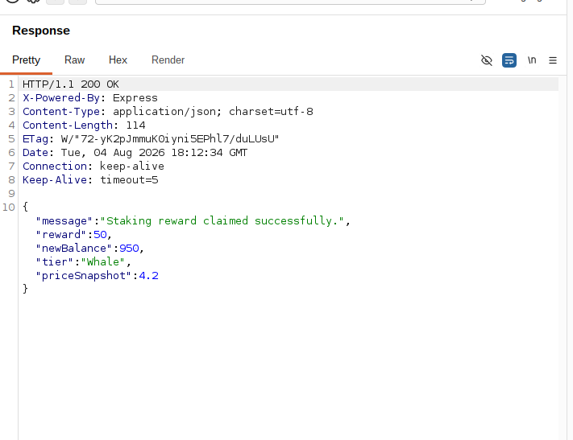
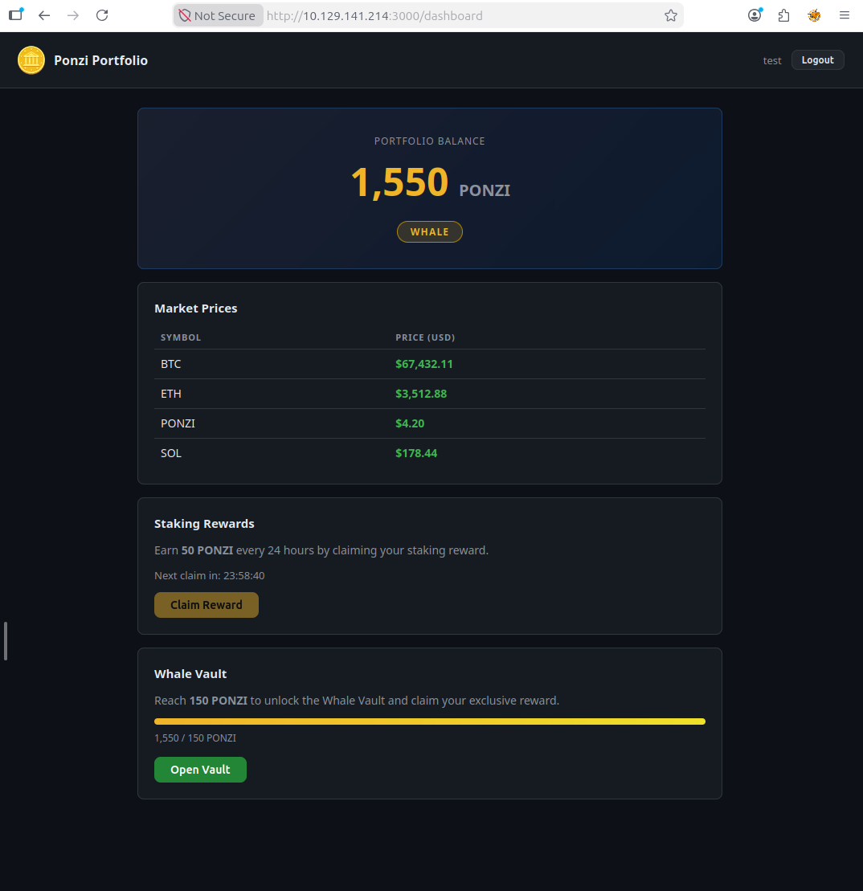

# 🏨 Hacker Holidays Day 8 – Towel on the Sunbed (CTF Write-up)

<p align="center">


</p>

---

## 📌 Challenge Overview

> Ponzi discovered a wellness rewards portal offering crypto-based incentives. The application enforces a **24-hour cooldown** between reward claims. However, inconsistencies between request handling and server-side validation introduce a vulnerability that allows multiple reward claims within a restricted timeframe.

🔗 **Room Link:** https://tryhackme.com/room/hh-towelonthesunbed-61271709

---

## 📊 Challenge Information

| Attribute  | Details                               |
| ---------- | ------------------------------------- |
| Platform   | TryHackMe                             |
| Challenge  | Hacker Holidays – Towel on the Sunbed |
| Difficulty | Medium                                |
| Category   | Web Exploitation                      |
| Target     | Web Application                       |
| Tools      | Burp Suite, FoxyProxy                 |

---

## 🎯 Objectives

* 🔎 Increase Ponzi balance beyond **150 coins**
* 🧾 Retrieve the **flag**
* ⚡ Exploit application logic weakness

---

## 🧭 Attack Flow Overview


---

## 🔍 Technical Analysis

### 🧩 Vulnerability: Race Condition (TOCTOU)

The application implements a **time-based restriction (24-hour cooldown)** for reward claims. However:

* ❌ No proper **server-side locking mechanism**
* ❌ Lack of **atomic transaction handling**
* ❌ Requests processed concurrently without synchronization

This results in a **Time-of-Check to Time-of-Use (TOCTOU)** vulnerability, allowing multiple successful reward claims before the system updates the user’s state.

---

## ⚙️ Exploitation Steps

### 🧑‍💻 Step 1: Register & Initial Interaction

* Create an account on the **Ponzi Wellness Rewards Portal**
* Claim the initial reward → **+50 coins**
* Observe enforced cooldown message

---

### 🌐 Step 2: Intercept Request

* Launch **Burp Suite**
* Enable **Proxy Intercept**
* Configure **FoxyProxy** in browser
* Click **Claim Reward**
* Capture the HTTP request

---

### 🔁 Step 3: Repeater Setup

* Send captured request to **Repeater**
* Create a **new group**
* Duplicate the request ~30 times

---

### ⚡ Step 4: Parallel Execution

* Use:

  ```
  Send group in parallel (last-byte sync)
  ```
* This ensures:

  * All requests hit the server **simultaneously**
  * Backend fails to enforce cooldown consistently

  📸 *Screenshot:*



---

### 💰 Step 5: Exploit Outcome

* Each request processes successfully
* Final balance:

  ```
  50 × 31 = 1550 coins
  ```
* Refresh browser → Updated balance visible

📸 *Screenshot:*


---

### 🏆 Step 6: Retrieve Flag

* Access the **Vault**
* Flag becomes available once threshold is exceeded

---

## 🧠 Key Takeaways

* ⚠️ **Race conditions** are critical in state-dependent applications
* 🔐 Always enforce **server-side synchronization**
* 🧱 Use:

  * Atomic operations
  * Mutex/locking mechanisms
  * Rate limiting
* 🧪 Parallel testing in tools like **Burp Repeater** can reveal logic flaws
* 🕒 Time-based controls must be backed by **robust backend validation**

---

## 🚨 Security Recommendations

* Implement **idempotent request handling**
* Enforce **strict backend validation**
* Introduce **request queuing or locking**
* Apply **rate limiting & replay protection**
* Log and monitor suspicious concurrent requests

---

## 👨‍💻 Author

**Sudharsan Chandran**
Cybersecurity Engineer | Offensive Security | SIEM | Automation

### 🔍 Areas of Interest

* 🔐 Network Security
* 🕵️ Digital Forensics
* 🧪 Penetration Testing
* 🤖 AI Security
* ⚙️ Security Automation

---

⭐ If you found this write-up helpful, consider giving it a star!
