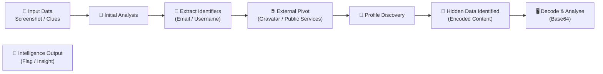

# 🔎 OSINT (Open Source Intelligence)

---

## 📌 Overview

This repository section showcases practical **Open Source Intelligence (OSINT)** investigations performed through platforms like TryHackMe and real-world inspired scenarios.

The focus is on extracting actionable intelligence from **publicly available data**, simulating how attackers, analysts, and security professionals uncover hidden information through indirect clues.

---

## 🎯 What This Section Demonstrates

* 🔎 **Analytical Thinking** – Breaking down unstructured data into meaningful intelligence
* 🧩 **Data Correlation** – Linking fragmented clues across platforms
* 🕵️ **Digital Footprinting** – Tracing identities using minimal information
* 🌐 **Tool-Based Enumeration** – Leveraging public tools and services
* 🔐 **Data Interpretation** – Identifying encoding, patterns, and hidden artifacts

---

## 🔄 OSINT Investigation Flow

---

## 🧠 Core OSINT Techniques Covered

* 📧 Email Enumeration & Pivoting
* 🌍 Public Profile Discovery (e.g., Gravatar)
* 🔗 Username & Identity Correlation
* 📡 Metadata & Indirect Information Analysis
* 🔐 Encoded Data Identification (Base64, etc.)

---

## 🧪 Labs & Write-ups

| Platform  | Challenge Name                                 | Focus Area                  |
| --------- | ---------------------------------------------- | --------------------------- |
| TryHackMe | Hacker Holidays Day 6 - Overheard at Breakfast | Email OSINT, Gravatar Pivot |

---

## 🧰 Tools & Technologies

* 🌐 **Gravatar** – Email-based profile discovery
* 🖥️ **Command Line (CLI)** – Data decoding and analysis
* 🔍 **Browser-Based OSINT Tools** – Public intelligence gathering

---

## 🚀 Why This Matters

OSINT plays a critical role in:

* 🛡️ **Threat Intelligence** – Tracking attacker infrastructure and identities
* 🔐 **Penetration Testing** – Reconnaissance phase
* 🕵️ **Digital Forensics** – Attribution and investigation
* 🏢 **Enterprise Security** – Exposure assessment of public assets

This repository demonstrates the ability to think like both an **attacker and defender**, identifying how seemingly harmless data can lead to security exposure.

---

## 📈 Continuous Learning

This section will be continuously updated with:

* 📚 Advanced OSINT challenges
* 🌐 Real-world investigation scenarios
* 🧪 Cross-domain intelligence techniques

---

## 👨‍💻 Author

**Sudharsan Chandran**

Cybersecurity Engineer | Offensive Security | Detection Engineering | Security Automation

---

⭐ *If you find this repository valuable, feel free to star it and follow my journey in cybersecurity.*
