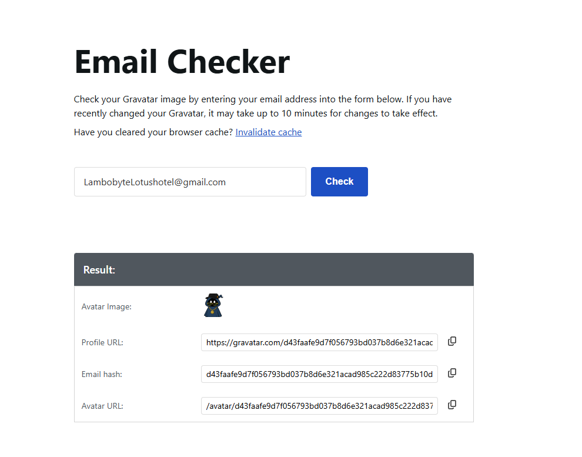
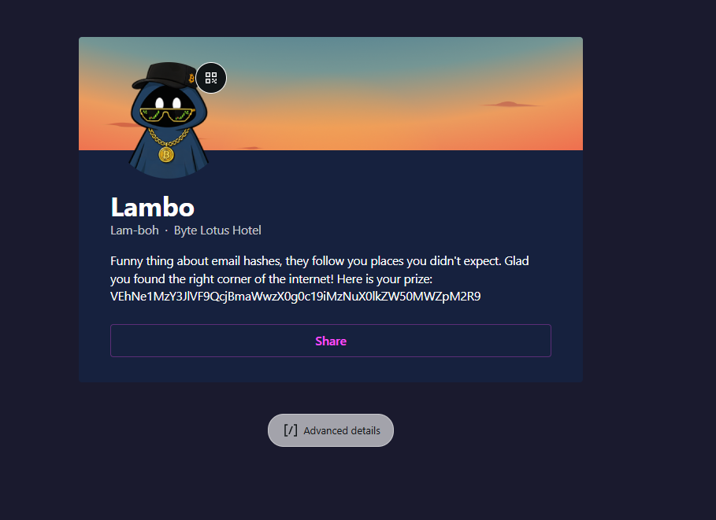

# 🏨 Hacker Holidays – Day 6: Overheard at Breakfast

<p align="center">


</p>

---

## 📌 Challenge Overview

> The breakfast terrace is loud this morning — clinking cutlery, espresso machines, and constant chatter. Among the noise, a guest overhears a conversation revealing more than intended.

During a brief moment when the table was unattended, a screenshot of the conversation was captured. Hidden within this seemingly casual interaction are key identifiers that can be used to trace a digital account.

### 🔍 Core Concept

This challenge demonstrates a real-world **OSINT (Open Source Intelligence)** workflow combined with:

* 🕵️ Identity correlation via indirect clues
* 🔎 Metadata and username pattern analysis
* 📡 Account discovery using public services
* 🔐 Data extraction from encoded formats

---

## 📊 Challenge Information

| Attribute       | Details                                        |
| --------------- | ---------------------------------------------- |
| Platform        | TryHackMe                                      |
| Challenge Name  | Hacker Holidays Day 6 - Overheard at Breakfast |
| Difficulty      | Easy                                           |
| Category        | OSINT / Network Forensics                      |
| Technique       | Covert Channel Identification                  |
| Attack Vector   | Data Exfiltration via Public Profile           |
| Target Artifact | Conversation Screenshot                        |
| Key Tool        | Gravatar                                       |

---

## 🎯 Objectives

* 🔎 Analyse the provided conversation screenshot
* 🧩 Extract identifiable information (email / username patterns)
* 🌐 Pivot to external services for account discovery
* 🔐 Retrieve and decode the hidden flag

---

## 🧪 Investigation Process

### 🔍 Step 1: Initial Analysis

* Reviewed the provided **conversation screenshot**
* Identified references to **social media platforms using “G” handles**
* Observed a potential **email address embedded within the conversation**

```
LambobyteLotushotel@gmail.com
```

---

### 🌐 Step 2: Account Enumeration via Gravatar

Used Gravatar’s email lookup functionality:

* Accessed: https://gravatar.com/site/check
* Queried the identified email address

This returned a **Gravatar profile hash**, indicating the email is registered:

```
https://gravatar.com/d43faafe9d7f056793bd037b8d6e321acad985c222d83775b10d6539e301e931
```
📸 *Screenshot:*

---

### 📡 Step 3: Profile Investigation

* Navigated to the retrieved **Gravatar profile URL**
* Identified embedded data containing the **flag encoded in Base64**

📸 *Screenshot:*

---

### 🔐 Step 4: Data Decoding

Decoded the Base64-encoded flag using the following command:

```bash
echo <base64value> | base64 -d
```

* Successfully retrieved the **final flag**

---

## 🧰 Tools Used

| Tool             | Purpose                        |
| ---------------- | ------------------------------ |
| 🌐 Gravatar      | Email-to-profile resolution    |
| 🖥️ CLI (base64) | Decoding encoded data (Base64) |

---

## 🧠 Key Takeaways

* 🔎 **OSINT techniques** can extract sensitive data from minimal clues
* 📧 Email addresses are powerful pivot points for **identity tracing**
* 🌐 Public services like **Gravatar** can unintentionally expose user data
* 🔐 Attackers often use **encoding (Base64)** for lightweight obfuscation
* 🕵️ Even casual conversations can leak **actionable intelligence**

---

## 👨‍💻 Author

**Sudharsan Chandran**

**Cybersecurity Engineer | Offensive Security | Detection Engineering | Security Automation**

### 🔬 Areas of Interest

* 🔐 Network Security
* 🕵️ Digital Forensics
* 🧪 Penetration Testing
* 🤖 AI Security
* ⚙️ Security Automation

---

⭐ *If you found this write-up useful, consider giving the repository a star!*
